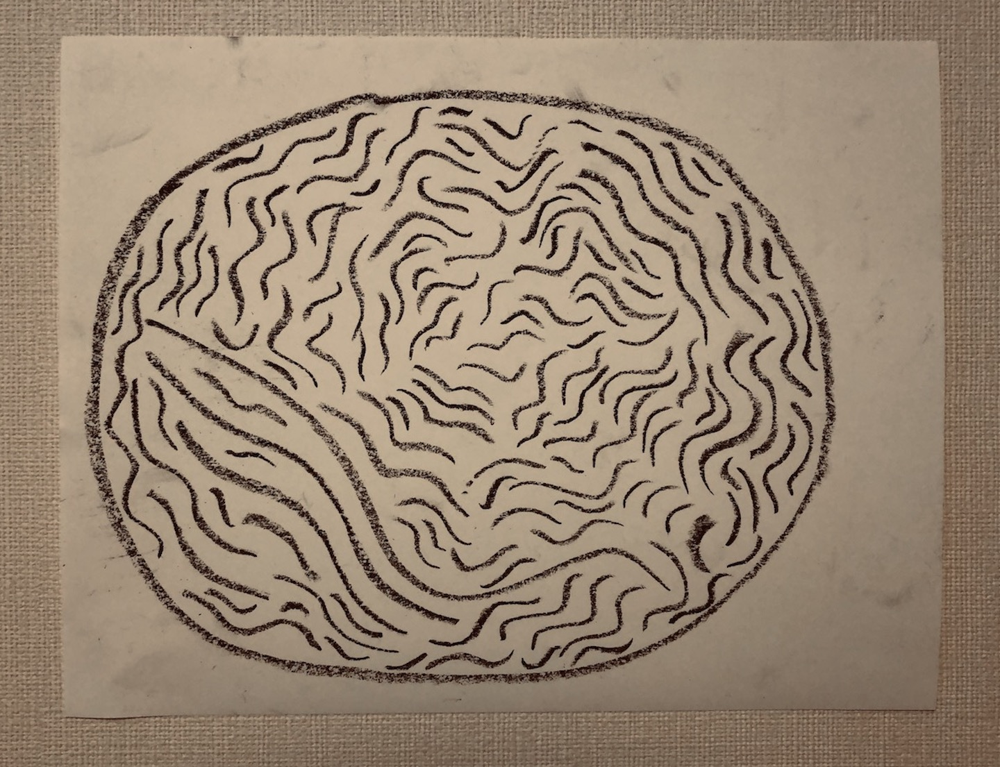
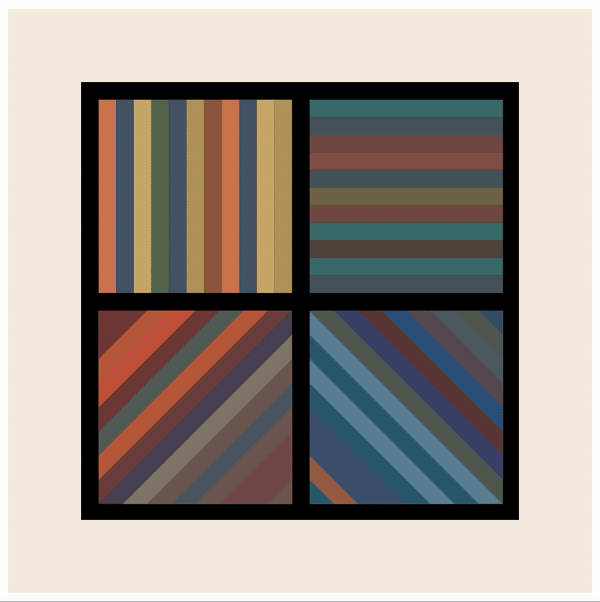
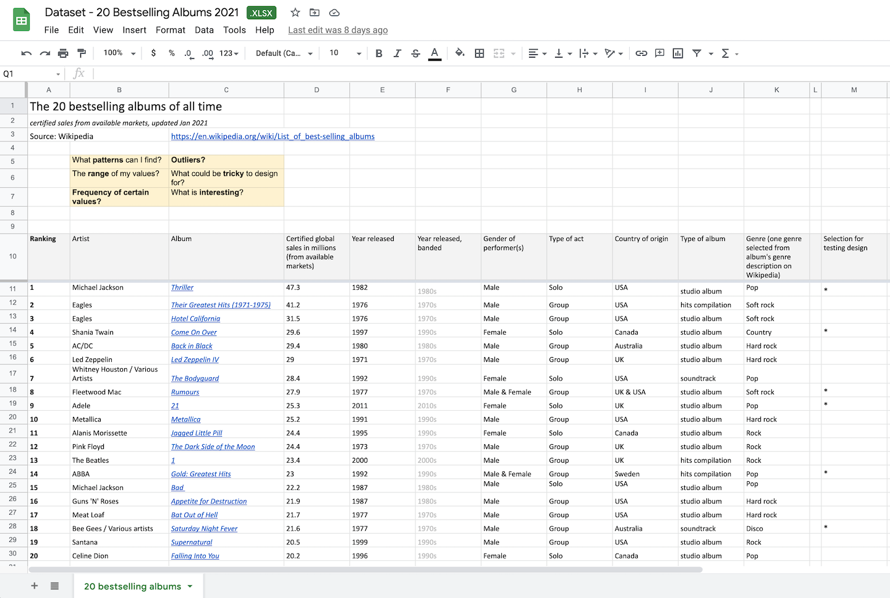
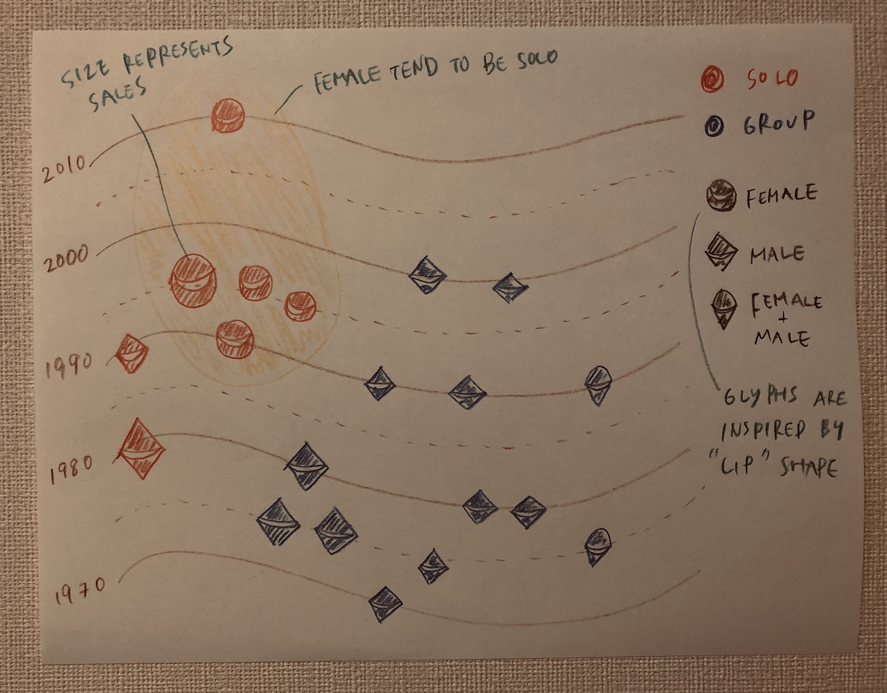

# Data-viz Drawing
- Reference
    - [Data-viz Drawing workshop](https://twitter.com/GraphicHunters/status/1386578160871956483) for GraphicHunters
    - [Data Visualization Workshop](https://observablehq.com/collection/@zachpino/id-iit-fall-2020-data-visualization-workshop) ID IIT Fall 2020

<br>

## Data visualization with the eyes of an artist
```
data visualization = data + artist's rules + visual variables + visual perception (clarity + legibility)
```
<br>


### Sol Lewitt, 1971
```
'each person draws a line differently and each person understands words differently.'
```
<br>


### Sol Lewitt's Drawing #1099
Within a circle(outline) draw *100* not straight lines. Black *crayon*, *within 7 min*, *June 2021*.



---

Within a circle(outline) draw 10,000 not straight lines. Black marker, July 2003.


Performed by Sara A. Tremblay and Félipe Goulet Letarte <br>
Photo credit - Guy L'Heureux <br>

<br>

### Sol Lewitt's Bands of Lines in Four Directions, 1993
[Encode](https://observablehq.com/@kieich/svg-composition-challenge) a palette of colors or set of geometries as a dataset for iterative looping. How might rigid patterns and randomness playfully intersect? <br>



---

[Upsilon Gallery](http://www.artnet.com/artists/sol-lewitt/bands-of-lines-in-four-directions-a-ptIX43CR8nXwOpbCyy1pKw2), New York


<br>

## Data analysis with an artist's / designer's eye
What patterns can I find? <br>
What is *interesting*?
<br>

### 20 albums
Dataset - [20 Bestselling Albums 2021](https://en.wikipedia.org/wiki/List_of_best-selling_albums)



---

What is *interesting*? <br>

```
Female tend to be solo (+ recent)
```



<br>

