# Memory Blossoms

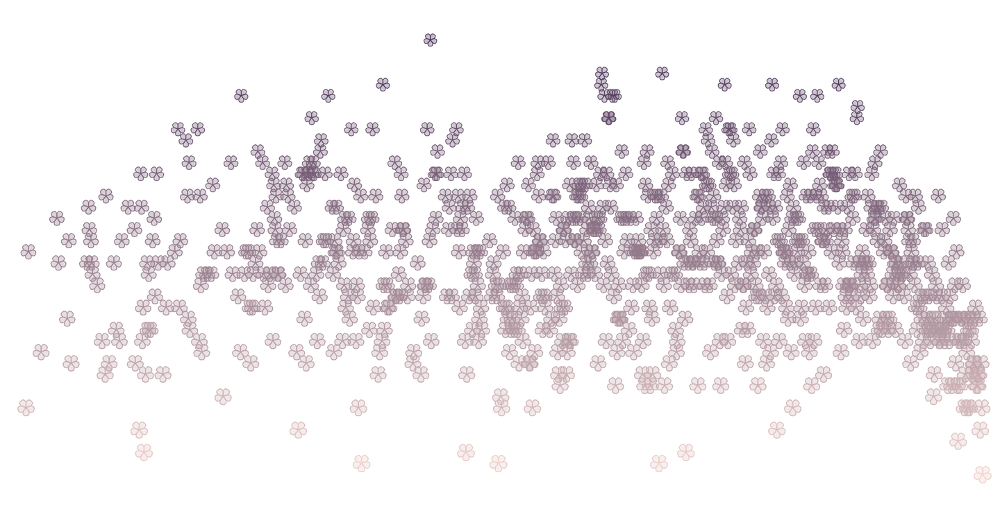

Data: [Phenological data series of cherry tree flowering](http://atmenv.envi.osakafu-u.ac.jp/aono/kyophenotemp4/) in Kyoto, Japan, from 800 AD to 2021, collected by Yasuyuki Aono, Keiko Kazui, and Shizuka Saito<br>

Blog: Here is [my blog post](https://medium.com/@kieich?p=a481498f7a58) that explains the design process of the project.<br>

<br>

Contents:
- [Data-viz Drawing](https://github.com/kieich/memory-blossoms#data-viz-drawing)
- [Data-viz with D3.js](https://github.com/kieich/memory-blossoms#data-viz-with-d3js)
- [Statistical Thinking in Python](https://github.com/kieich/memory-blossoms#statistical-thinking-in-python)

<br>

<p align="center">
    
</p>

- Visit [this notebook](https://observablehq.com/@kieich/memory-blossoms-create-your-own) and create your own Memory Blossoms!
- Ask for help! If anyone has any suggestions on how to create petals without changing some data points with dummy data, please let me know :) Any advice would be appreciaated.

<br>

# Data-viz Drawing

I was inspired to begin my data visualization studies through "Data-viz drawing" as presented by designer Giorgia Lupi and Stefanie Posavec in Dear Data. Participating in online Data-viz drawing workshop with Stefanie Posavec on Jun 2-3, 2021 and crafting something imperfect on my own, I try to deepen my understanding of "data visualization" that goes beyond basic charts, on top of what I learned at the IIT Institute of Design's Data Visualization workshop Fall 2020.

- Visit [this page](Note/Dataviz-drawing.md) to learn more about messy(ish) experimentation.
  <br>

<br>

## Visual Inspiration

### Breaking down a subject into visual variables

Lovely visuals by Staphanie Posavec

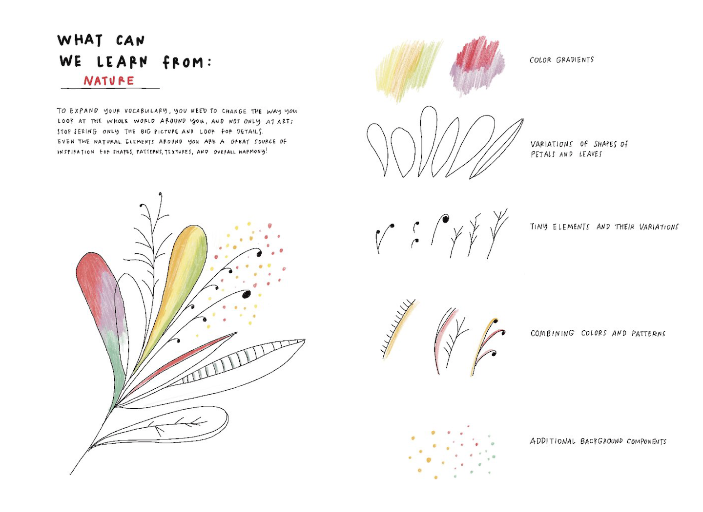
<br>

### Color Gradients


- Python code [left](./assets/src/color-exploration.py), [right](./assets/src/cubehelix-random-heatmap.py)
- Reference [left](https://seaborn.pydata.org/generated/seaborn.cubehelix_palette.html#seaborn.cubehelix_palette), [right](https://seaborn.pydata.org/generated/seaborn.heatmap.html)<br>

<br>

### Variations of shapes of petals


- See SVG code [here](./assets/src/petals.js).
- Reference [here](https://observablehq.com/collection/@sxywu/introduction-to-d3-js).

<br>

# Data-viz with D3.js

## Resources

Highly recommend those free online tutorials for D3.js + JS beginners.

- [D3 in Depth](https://www.d3indepth.com/)
- [D3 for R Users](https://jtr13.github.io/d3book/)
- [D3.js Playbook](https://gramener.github.io/d3js-playbook/index.html)
- [freeCodeCamp](https://www.freecodecamp.org/learn/data-visualization/)

<br>

Also, visit my collection of [Intro to D3.js](https://observablehq.com/collection/@kieich/intro-to-d3-js) @Observable <br>

<br>
<br>

## Graphical Exploratory Data Analysis

- Some [notes](Note/Data-analysis.md) I've taken at the online dataviz workshop by Shirley Wu

<br>

**_Scatterplot_**

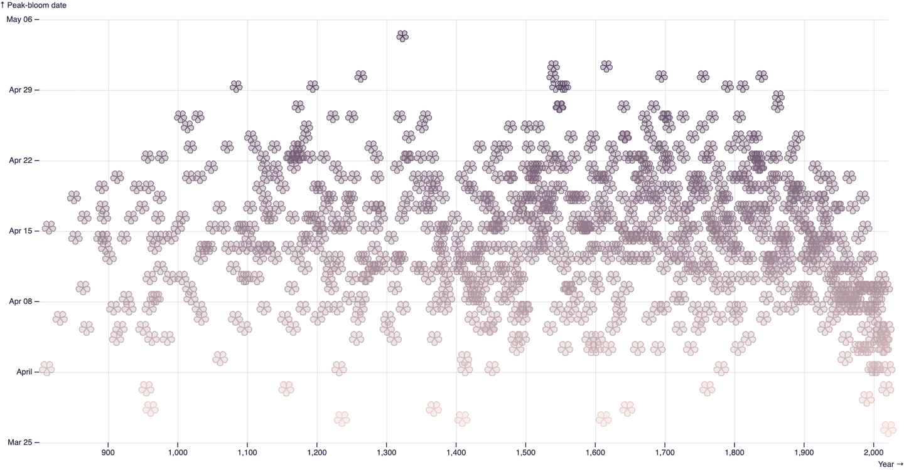

Observable notebook [here](https://observablehq.com/@kieich/memory-blossoms-scatterplot). <br>

<br>

**_Area chart with Missing Data_**

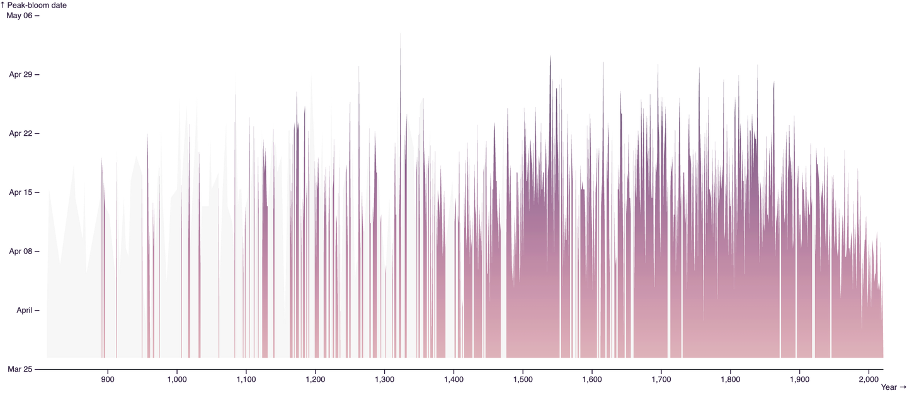

Observable notebook [here](https://observablehq.com/@kieich/memory-blossoms-area-chart). <br>

<br>

**_Line chart with Missing Data_**

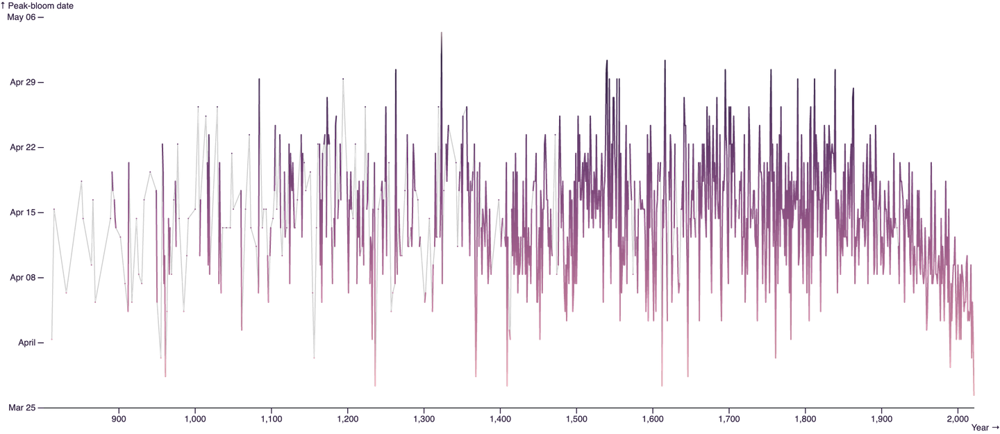

Observable notebook [here](https://observablehq.com/@kieich/memory-blossoms-line-chart). <br>

<br>

**_Radial line chart with Missing Data_**

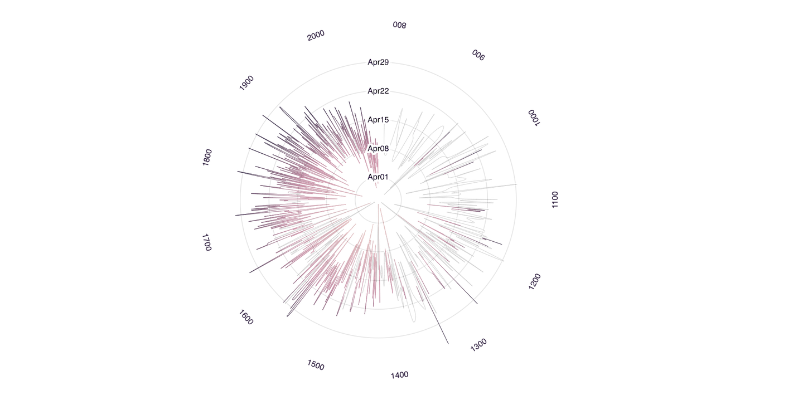

Observable notebook [here](https://observablehq.com/@kieich/memory-blossoms-radial-line-chart). <br>

<br>

**_Histogram_**

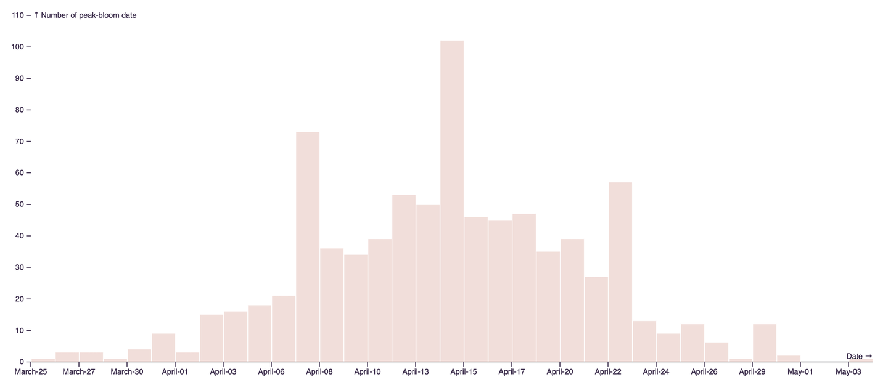

Observable notebook [here](https://observablehq.com/@kieich/memory-blossoms-histogram). <br>

<br>
<br>

# Statistical Thinking in Python

- Reference: Statistical Thinking in Python (Part 1/2) @[datacamp](https://www.datacamp.com)
- [Note](Note/Note.md)

> Special thanks to #データ可視化の学び場, @hayataka88, and everyone in the community!
<br>

## Graphical Exploratory Data Analysis

**_Histogram_**

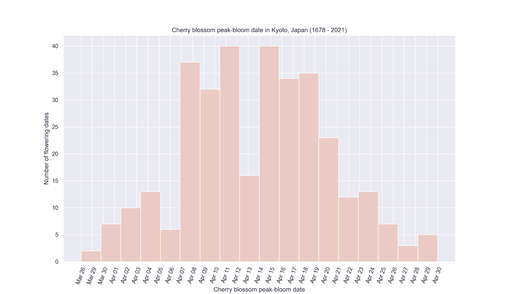

See Python code [here](./assets/src/cbpb-histogram.py). <br>
<br>

**_Scatter plot_**

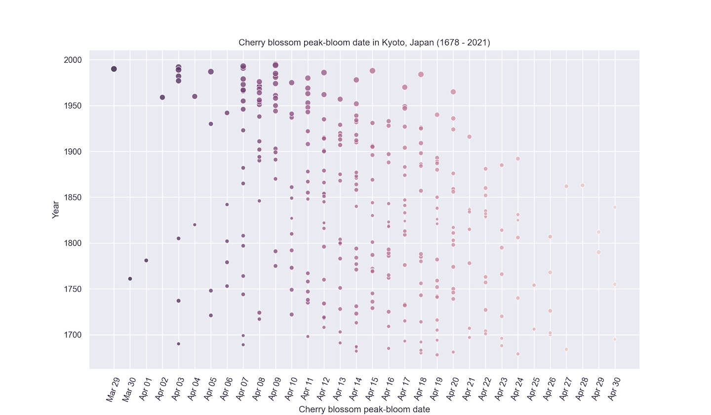

Color represents peak-bloom date. Size represents temperature. See Python code [here](./assets/src/cbpb-scatterplot2.py). <br>
<br>

## Quantitative Exploratory Data Analysis

**_Comparing percentiles to ECDF_**

```
percentiles: [401. 409. 414. 418. 426.] float64
```
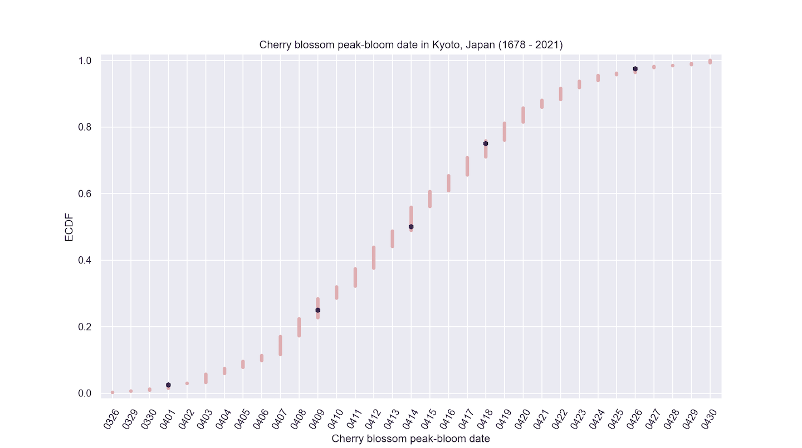

See Python code [here](./assets/src/percentiles-ecdf.py). <br>

<br>

**_Box-and-whisker plot_**

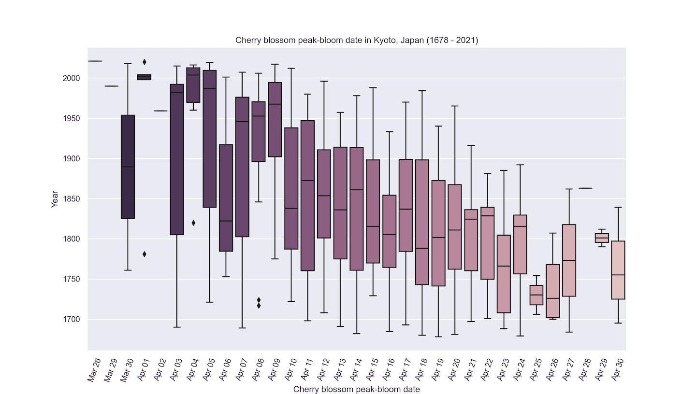

See Python code [here](./assets/src/cbpb-box-plot.py). <br>

<br>

## Thinking Probabilistically

**_Linear regression_**

```
slope = -0.015823592193534804 estimated temp / peak bloom date
intercept = 14.114277800365738 estimated temp
```
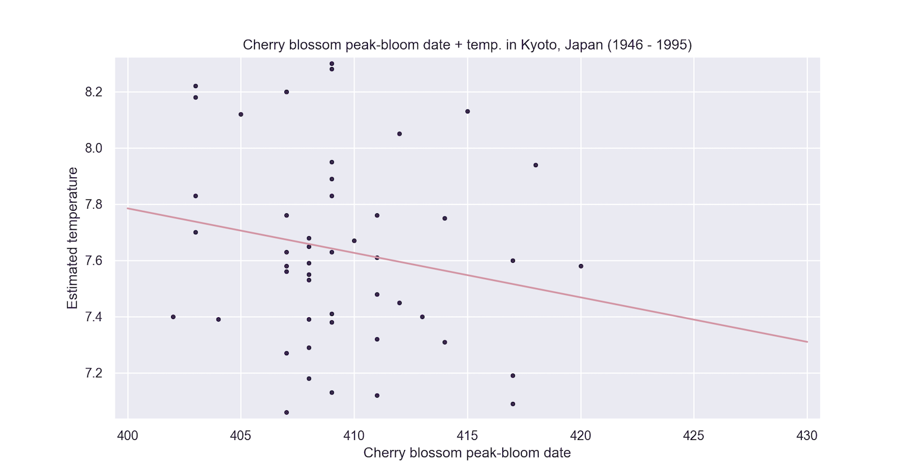

See Python code [here](./assets/src/cbpb-linear-regression.py). <br>

<br>

**_Visualizing bootstrap samples_**

```
mean: 409.42857142857144
median: 409.0
std: 3.917516914514882
```

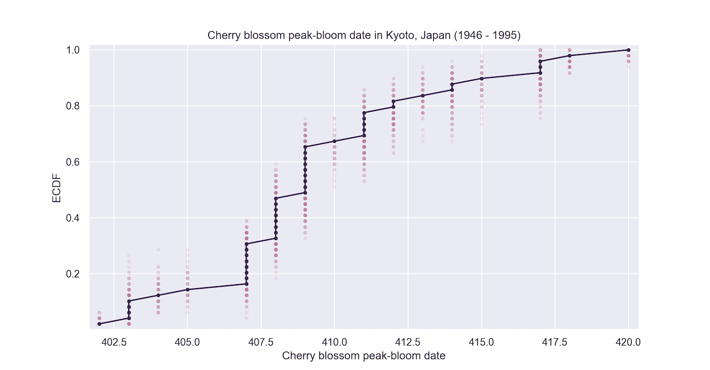

See Python code [here](./assets/src/cbpb-bs-samples.py). <br>

<br>

<!-- ### Confidence interval of a statistic -->
**_Bootstrap replicates_**

```
sem: 0.5783480621330582
std: 0.5818109818422588
95% confidence interval = [408.24489796 410.51020408]
```

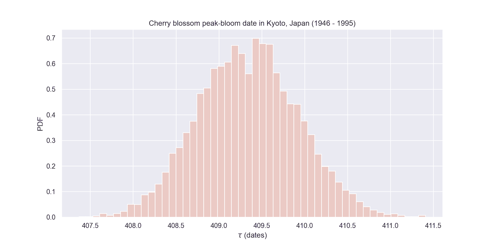

See Python code [here](./assets/src/cbpb-bs-replicates.py). <br>

<br>

**_95% confidence interval for the mean_**

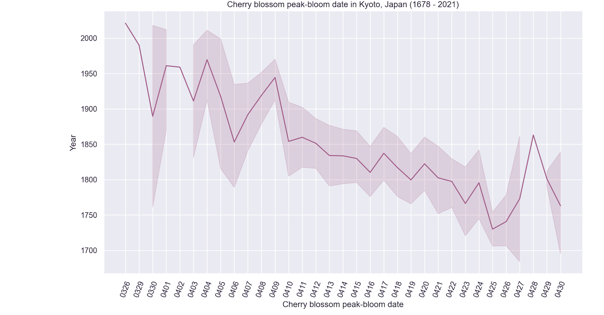

See Python code [here](./assets/src/cbpb-confidence-intvl.py). <br>

<br>
